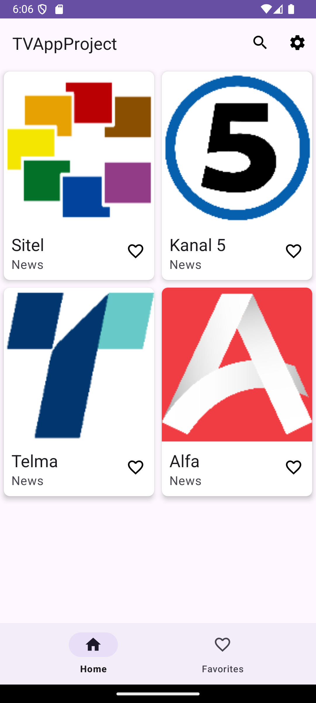
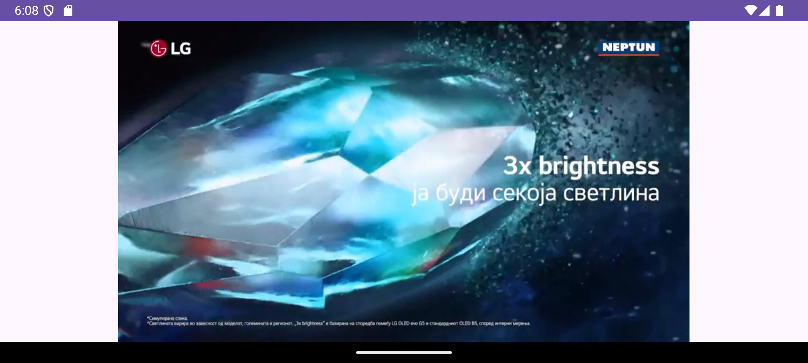
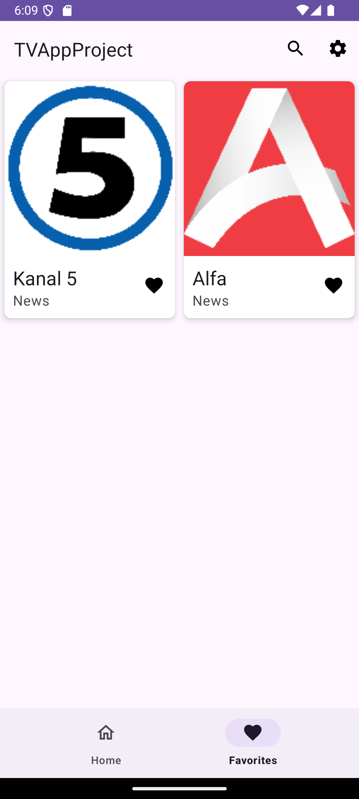

# TV App Mk

## Overview
TV App MK is a simple Android application designed for watching live Macedonian TV channels on your mobile device.

## Features
- **Live TV Streaming**: Watch your favorite TV channels in real-time.
- **Live Search**: Search the list of available channels
- **Favorites**: Save the channels.

## Screenshots
<p align="center">
  
  <br><em>Home Screen</em>
</p>

<p align="center">
  
  <br><em>Favorites Screen</em>
</p>

<p align="center">
  
  <br><em>Player Screen</em>
</p>


## Installation

### Prerequisites
- **Android Version**: 7.0 (Nougat) or higher
- **Internet connection**: Required for streaming

### Steps
1. Clone the repository:
   ```bash
   git clone https://github.com/davidris123/livetvmk-android.git
